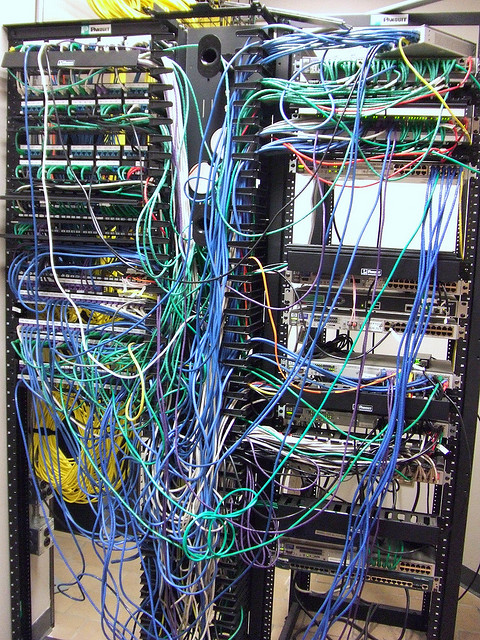
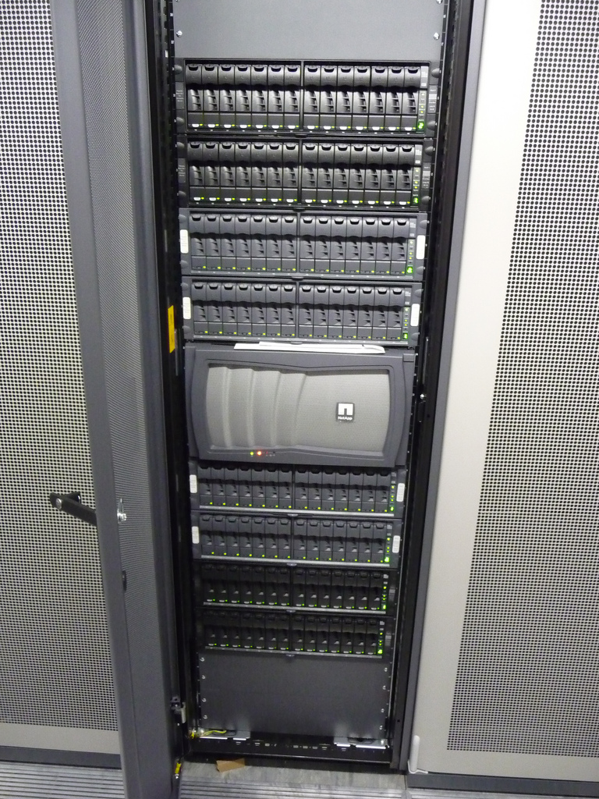

!SLIDE transition=fade
# The Differences

!SLIDE transition=fade
# Networking

!SLIDE transition=fade

!SLIDE transition=fade
# Goodbye multicast

!SLIDE transition=fade
# Do I use that?

!SLIDE comic
# Yes

!SLIDE transition=fade
# Goodbye proximity

!SLIDE transition=fade

!SLIDE transition=fade

!SLIDE transition=fade
# Hello...

!SLIDE bullets incremental transition=fade
# latency?

* o_O

!SLIDE transition=fade

!SLIDE transition=fade
# Storage

!SLIDE transition=fade
# Storage was getting fast...

!SLIDE transition=fade

!SLIDE transition=fade

!SLIDE bullets incremental transition=fade
# Goodbye speed

* Hello... IO Throttling

!SLIDE transition=fade

!SLIDE transition=fade

!SLIDE transition=fade
# Introducing Eventual Consistency

!SLIDE bullets incremental transition=fade
# Remember
* No Complaining...
